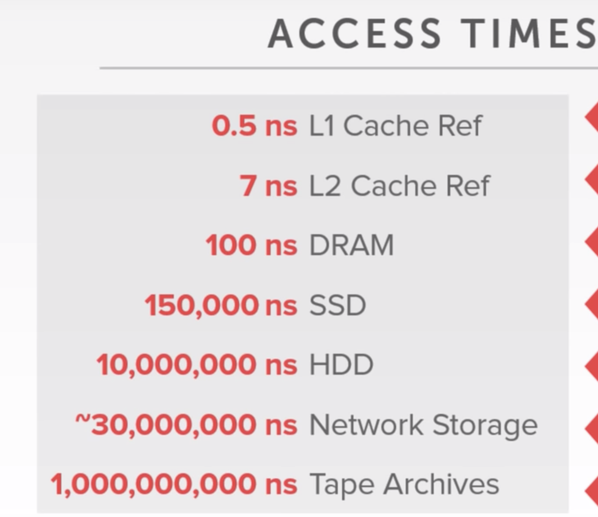
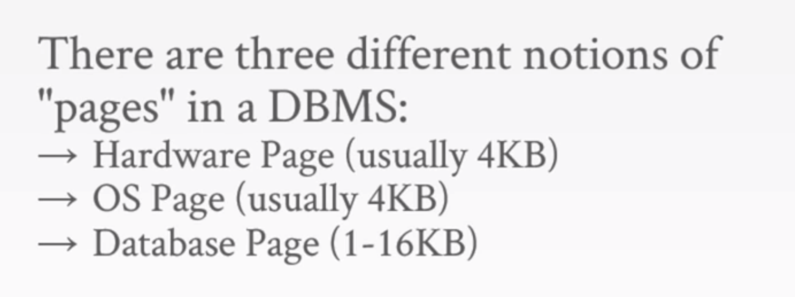
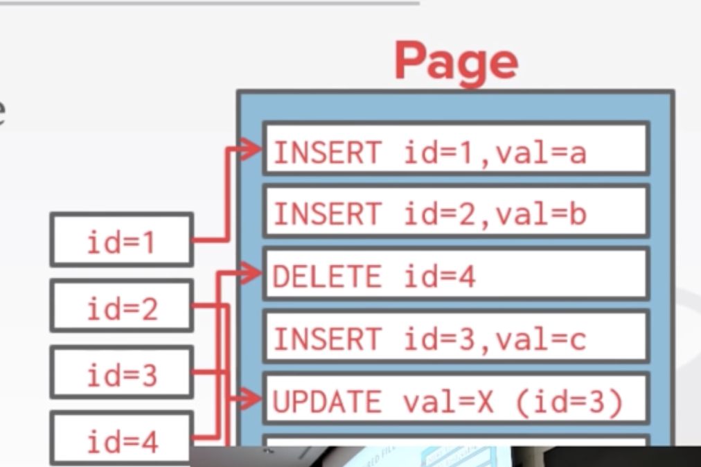

# CMU DB System

- 

- Virtual Memory is an abstraction for memory. 

  - The OS provide this abstraction to applications. So page fault/swapping is invisible to users.
  - physic memory+swapping area in HD

- Database Page/Block

  - fixed size
  - Unique ID as identifier

- types of page

  

  - page structure
    - header
      - page size
      - checksum
      - DBMS version
      - Transaction visibility
      - Compression Information
    - Data
      - tuple-oriented
        - Strawman idea: just store tuple sequentially
          - Problem: CRUD will be O(n) complexity since you could only traverse the page to find the tuple
        - Slotted Pages: split the page into smaller slots and store the infos of slots in the page header
          - In the header, the # of used slots will be recorded
          - the # of the first unused slot will also be recored.
          - O(1) complexity
      - Log-oriented: just keep appending. Deletion and modification all by appending new logs
        - problem: read is too slow. we must traverse all the logs to confirm the value.
        - Solution: build index to to allow it to jump to the corresponding locations
          
        - periodically compact the logs
        - used by HBase, Cassandra, LevelDB
  - tuple layout
    - essentially just sequence of bytes
    - so it's the DBMS's job to determine how to interpret them into attributes, etc.
    - tuple structure:
      - header
        - visibility info used for concurrency control
        - Bitmap for null values(0/1 array to represent the location of null你e)
      - body