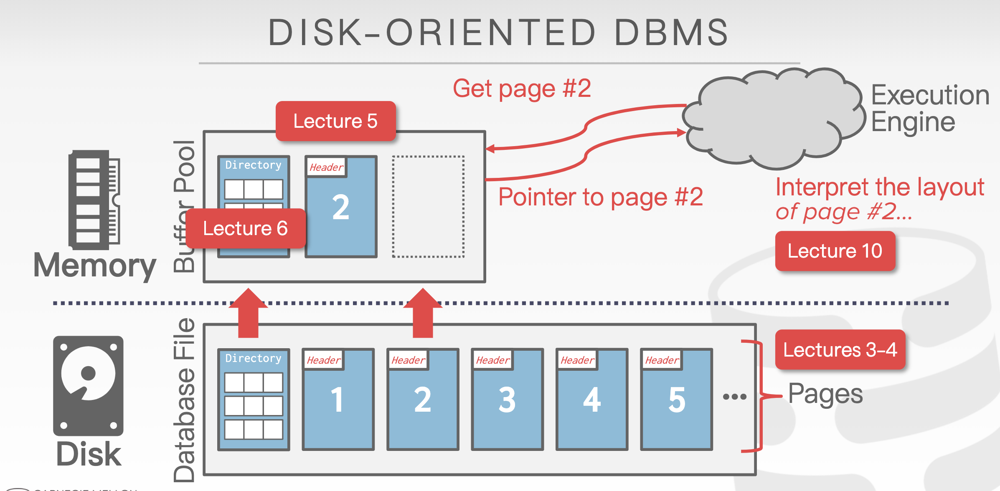
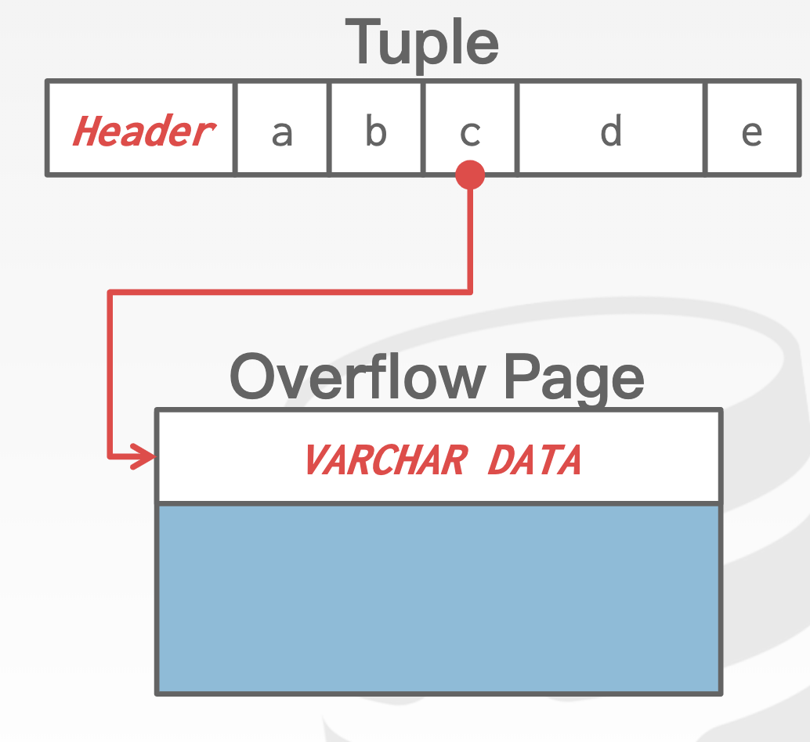
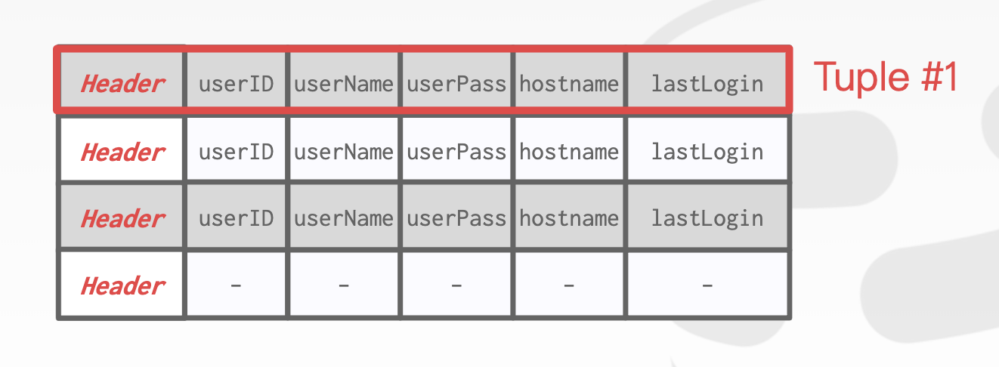
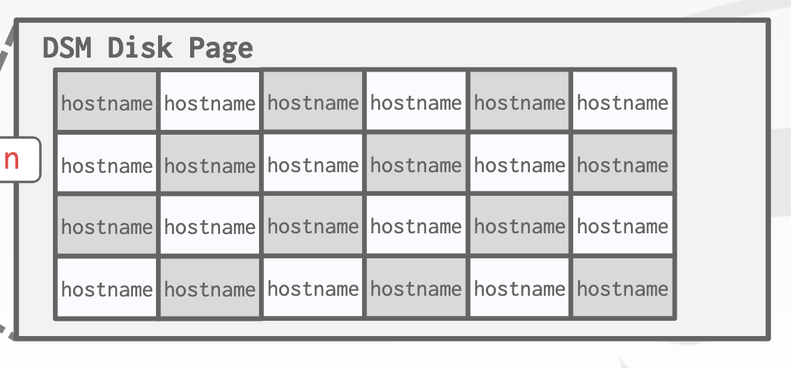
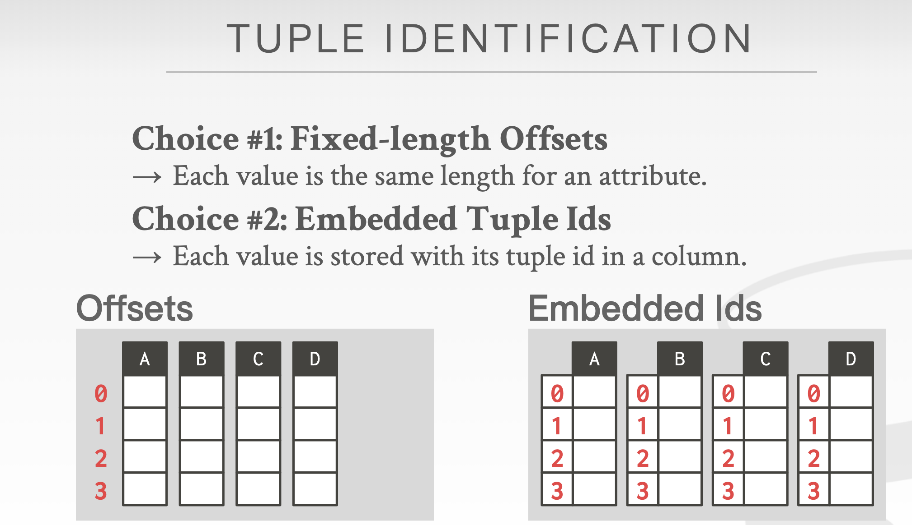
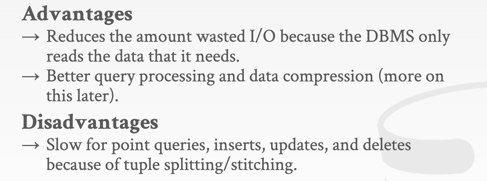

# CMU DB System

## Storage 1

- 

- Virtual Memory is an abstraction for memory. 

  - The OS provide this abstraction to applications. So page fault/swapping is invisible to users.
  - physic memory+swapping area in HD

- Database Page/Block

  - fixed size
  - Unique ID as identifier

- types of page

  

  - page structure
    - header
      - page size
      - checksum
      - DBMS version
      - Transaction visibility
      - Compression Information
    - Data
      - tuple-oriented
        - Strawman idea: just store tuple sequentially
          - Problem: CRUD will be O(n) complexity since you could only traverse the page to find the tuple
        - Slotted Pages: split the page into smaller slots and store the infos of slots in the page header
          - In the header, the # of used slots will be recorded
          - the # of the first unused slot will also be recored.
          - O(1) complexity
      - Log-oriented: just keep appending. Deletion and modification all by appending new logs
        - problem: read is too slow. we must traverse all the logs to confirm the value.
        - Solution: build index to to allow it to jump to the corresponding locations
          
        - periodically compact the logs
        - used by HBase, Cassandra, LevelDB
  - tuple layout
    - essentially just **sequence of bytes**
    - so it's the **DBMS's job to determine how to interpret** them into attributes, etc.
    - tuple structure:
      - header
        - **visibility info used for concurrency control**
        - **Bitmap for null values**(0/1 array to represent the location of null value)
      - body
        - attributes usually stored in the order you create them
        - Most DBMS won't allow a tuple exceeds the size of a page
  - Most DBMSs have an indirection layer that keeps maps a page id to a file path and offset.
  - The most common representation of tuple: **pageid+offset/slot.**
  - 2 ways for DBMS to locate a DB page in the disk:
    1. **Linked List**: Header page holds pointers to list for free and data pages
    2. **Page Directory**: DBMS maintains special pages that track locations of data pages.

## Storage 2

- Disk-oriented DBMS - the most common way: directory page + slotted page body

  

- If the size of tuple exceeds the page size/certain size, overflow page will be used
  

- DBMS catalog:

  - Tables, columns, indexes, views
  - Users, Permission
  - Internal Statistics

- **OLTP和OLAP**: an important concept

  - OLTP，也叫联机事务处理（Online Transaction Processing），表示事务性非常高的系统，一般都是高可用的在线系统，**以小的事务以及小的查询为主**，评估其系统的时候，一般看其每秒执行的Transaction以及Execute SQL的数量。在这样的系统中，单个数据库每秒处理的Transaction往往超过几百个，或者是几千个，Select 语句的执行量每秒几千甚至几万个。典型的OLTP系统有电子商务系统、银行、证券等，如美国eBay的业务数据库，就是很典型的OLTP数据库。OLTP系统最容易出现瓶颈的地方就是**CPU与磁盘子系统。**
  - OLAP，也叫联机分析处理（Online Analytical Processing）系统，有的时候也叫DSS决策支持系统，就是我们说的数据仓库。在这样的系统中，**语句的执行量不是考核标准，因为一条语句的执行时间可能会非常长，读取的数据也非常多**。所以，在这样的系统中，考核的标准往往是磁盘子系统的吞吐量（带宽），如能达到多少MB/s的流量

- **N Ary storage model**

  - 杭存储
  - the DBMS stores all attributes for a single tuple contiguously in a page
  - **Ideal for OLTP workloads where queries tend to operate only on an individual entity and insertheavy workloads.**
  - 
  - Advantage:
    - fast insert, update and delete
    - good for queries that need the entire tuple
  - Disadvantage:
    - not good for scanning large portion of the table and/or subset of the attributes(lead to a lot of useless data)

- **Decomposition storage model**

  - **列存储**模型
  - The DBMS stores the values of a single attribute for all tuples contiguously in a page.
  - 
  - 
  - 

  