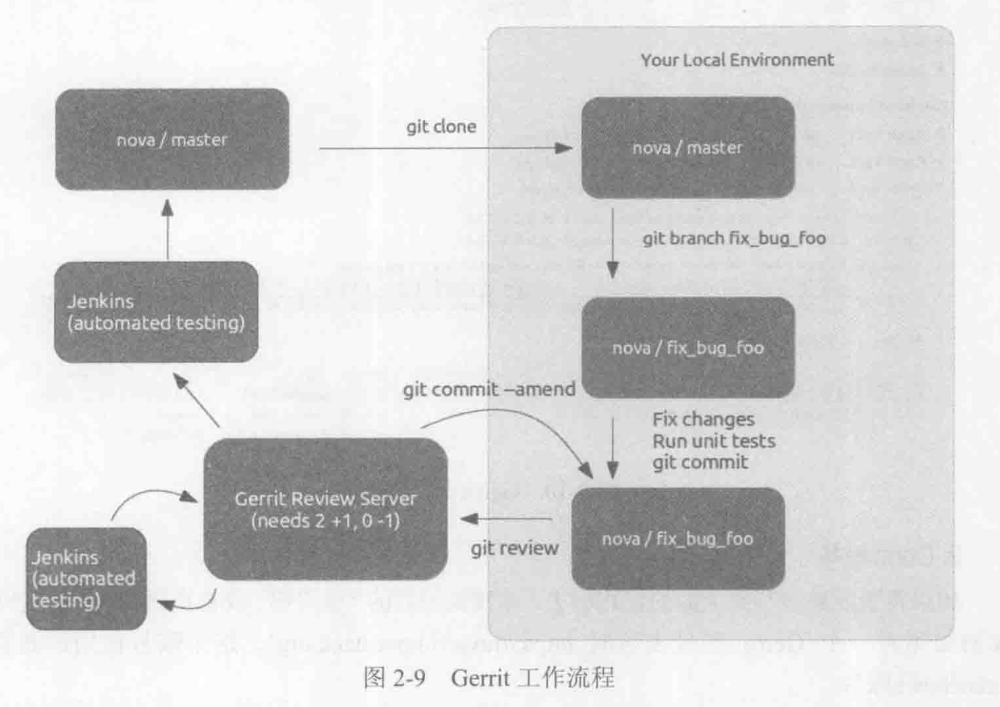
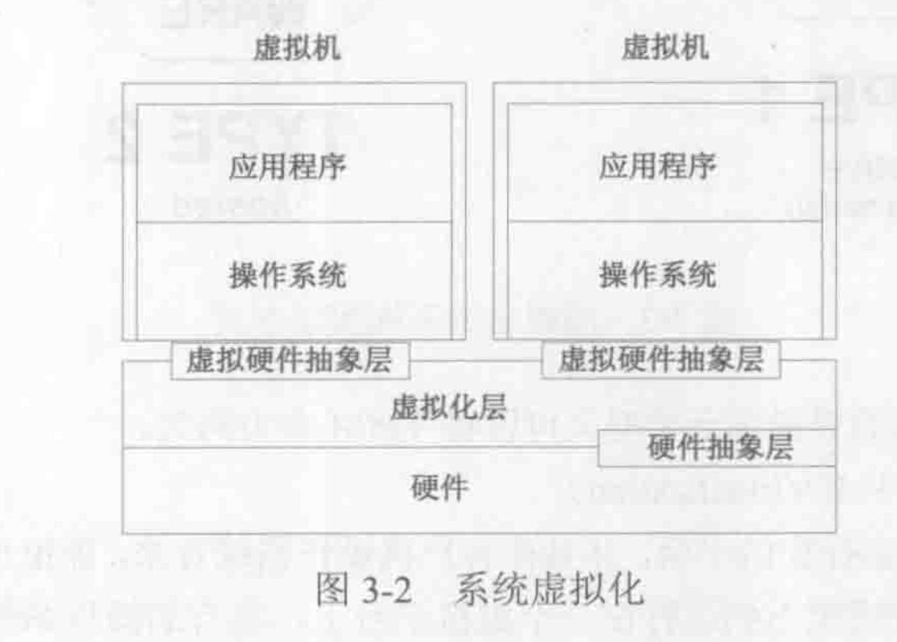
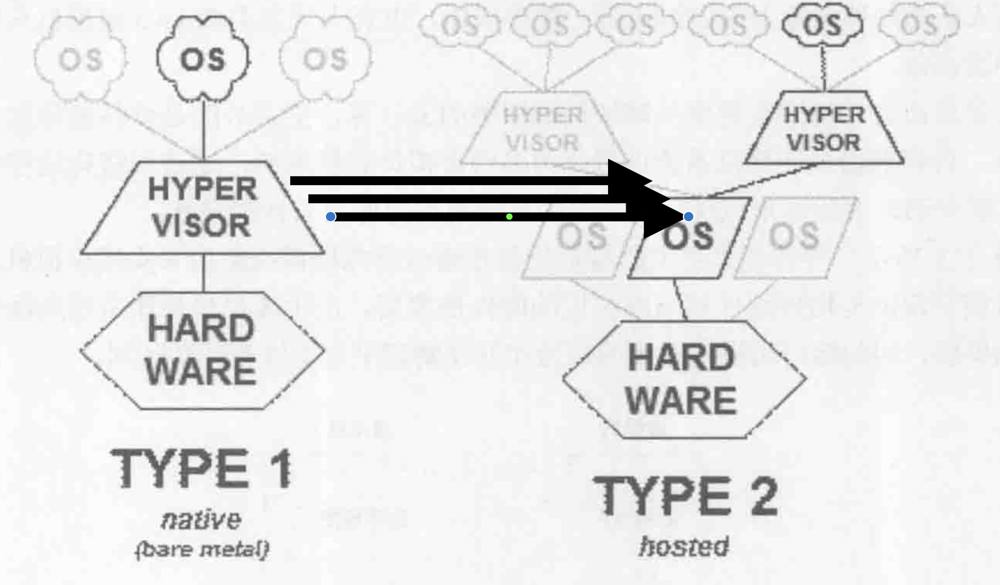
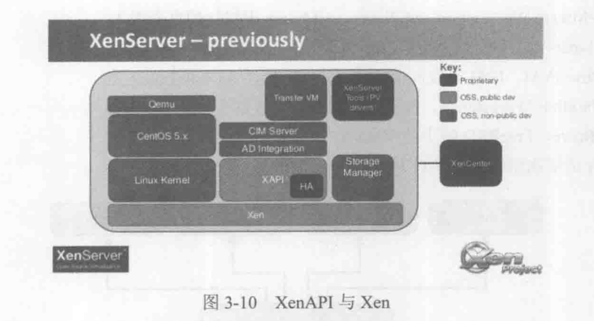
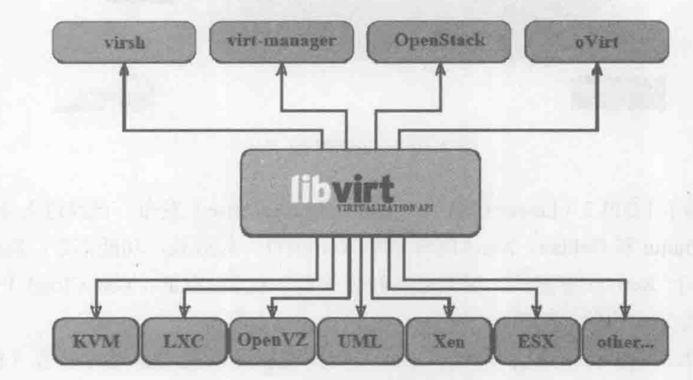
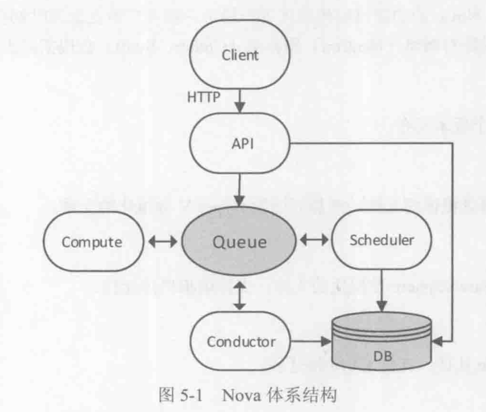

# OpenStack设计与实现阅读笔记

- OpenStack is implemented according to Amazon Web Service. AWS
- 与运行在物理节点上的hypervisor进行交互，实现对硬件资源的管理和控制
- Nova - ec2
- swift - s3
- cinder - ebs
- keystone - iam

## Componenrt Overview

### Nova

- provide VM service. The overall controller. Compatible to EC2 api as well.
- Nova components:
  1. Nova-api: provide services to outside (including both client-user and admin). Compatible with AWS EC2 API
  2. Nova-compute: the process installed in every physical node. It receives request and translate the request to a set of operations provided by the API from Hypervisor. For example: 
     - Hypervisor XenServer - XenAPI 
     - KVM, QEMU - libvirt
     - VMware - VMware api
  3. Nova-scheduler: receives the request of creating a new VM and decide which physical node will be chosen as the place.
  4. Nova-conductor: between Nova-compute and Nova-db, served as the forwarding role.
  5. Nova-db: contains a lot of DB tables to record the state of VM, the mappings of VM and physic nodes and the infos of tenants.
  6. Nova-console/Nova-consoleauth: the services that allows the user to access the console of the VMs
  7. Nova-cert and Nova-objectstore

### Swift - object storage

- used to stored and retrieve object
- Swift components
  1. Proxy-server: between the inside and outside of Swift. It receives api or HTTP requests like uploading, modifying metadata and creating a container. 
  2. Account-server: used for account management
  3. Container-server: manage the mappings between containers to directories.
  4. Object-server: manage the object stored on the storing node, like files.

### Keystone - Identity service

- Provide services of certification and authorization for users and manage their privileges. Giving a list of available services
- Keystone components:
  1. Keystone-API: receives requests
  2. Keystone-db

### Cinder - Volume storage

- Cinder-api: receives requests and forwarding them to Cinder-volume
- CInder-volume: Interact with the lower-level block storage service. Different Storage service provider implemented different driver for Cinder-volume,
- Cinder-scheduler: Like Nova-scheduler, to determine which storage node should be chosen for creating a new volume.
- Cinder-db: maintain inner infos.

### Neutron - Network service

- Provides support for net-device providers via 'plugins'
- Neutron components:
  1. Neutron-server: receives API requests and forwarding them to corresponding neutron plugin

### Glance - image service

- Provides services of storing, retrieving and searching for images

**a classic paragraph to desc the relationships btw components **

- **插播：看了linus torvalds早年在google做的git宣传pre，发现原来linus是个narcissist hhhh. Git的设计理念确实很强：分布式+branch的想法让不同expertise的人各司其职。**

- 橡皮鸭调试法hhhhh

- 

- 
  - 虚拟化的主流实现方式

    1. 直接在硬件驱动上进行封装(Xen)
    2. 在操作系统上进行封装(KVM, VirtualBox)

    

  - 主流虚拟化服务提供商

    1. VMware, 基于操作系统的虚拟化
    2. Xen，通过修改linux kernel，实现硬件的虚拟化
    3. KVM，也是基于硬件的虚拟化，作为模块运行在linux内核上

  - 虚拟化管理工具：VMM本身只提供虚拟化的基础架构，最后和用户相关的工作还是要通过虚拟化管理工具来实现

    1. XenAPI
       
    2. libvirt
       

  - RESTful: Representation State Transfer表现层状态迁移

    - 用URI表示资源，用HTML谓词（get, post, delete, update, etc.）表示描述操作

  - 协程(coroutine): 是进城的子单位

    1. 拥有自己的栈和局部变量
    2. 与统一进程下的其他协程共享全局变量
    3. 与线程不一样：不会并发执行，而是被执行协程阻塞了，另一个协程接手执行
    4. 不需要考虑锁的问题，舒服
    5. 执行顺序和时间长短由用户自己决定，舒服（线程由OS决定）
    6. 本质是线程内的伪并发

  - Eventlet: python lib to provide coroutine support

## Nova

- architecture
  
- four core module: 
  1. API
  2.  compute: interact with VMM
  3. scheduler: choose the phy node to deploy new VM
  4. conductor: abstraction for DB acces
     - Communicate through AMQP(advanced message queue protocol)