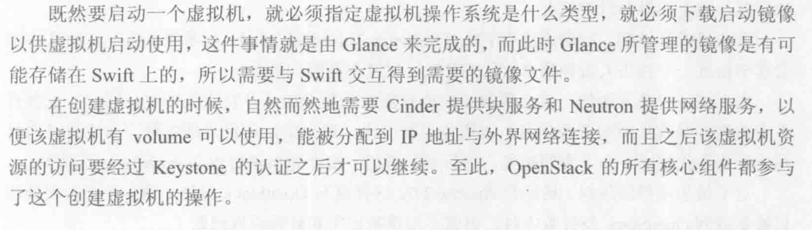

# OpenStack设计与实现阅读笔记

- OpenStack is implemented according to Amazon Web Service. AWS
- 与运行在物理节点上的hypervisor进行交互，实现对硬件资源的管理和控制
- Nova - ec2
- swift - s3
- cinder - ebs
- keystone - iam

## Componenrt Overview

### Nova

- provide VM service. The overall controller. Compatible to EC2 api as well.
- Nova components:
  1. Nova-api: provide services to outside (including both client-user and admin). Compatible with AWS EC2 API
  2. Nova-compute: the process installed in every physical node. It receives request and translate the request to a set of operations provided by the API from Hypervisor. For example: 
     - Hypervisor XenServer - XenAPI 
     - KVM, QEMU - libvirt
     - VMware - VMware api
  3. Nova-scheduler: receives the request of creating a new VM and decide which physical node will be chosen as the place.
  4. Nova-conductor: between Nova-compute and Nova-db, served as the forwarding role.
  5. Nova-db: contains a lot of DB tables to record the state of VM, the mappings of VM and physic nodes and the infos of tenants.
  6. Nova-console/Nova-consoleauth: the services that allows the user to access the console of the VMs
  7. Nova-cert and Nova-objectstore

### Swift - object storage

- used to stored and retrieve object
- Swift components
  1. Proxy-server: between the inside and outside of Swift. It receives api or HTTP requests like uploading, modifying metadata and creating a container. 
  2. Account-server: used for account management
  3. Container-server: manage the mappings between containers to directories.
  4. Object-server: manage the object stored on the storing node, like files.

### Keystone - Identity service

- Provide services of certification and authorization for users and manage their privileges. Giving a list of available services
- Keystone components:
  1. Keystone-API: receives requests
  2. Keystone-db

### Cinder - Volume storage

- Cinder-api: receives requests and forwarding them to Cinder-volume
- CInder-volume: Interact with the lower-level block storage service. Different Storage service provider implemented different driver for Cinder-volume,
- Cinder-scheduler: Like Nova-scheduler, to determine which storage node should be chosen for creating a new volume.
- Cinder-db: maintain inner infos.

### Neutron - Network service

- Provides support for net-device providers via 'plugins'
- Neutron components:
  1. Neutron-server: receives API requests and forwarding them to corresponding neutron plugin

### Glance - image service

- Provides services of storing, retrieving and searching for images

**a classic paragraph to desc the relationships btw components **

**

